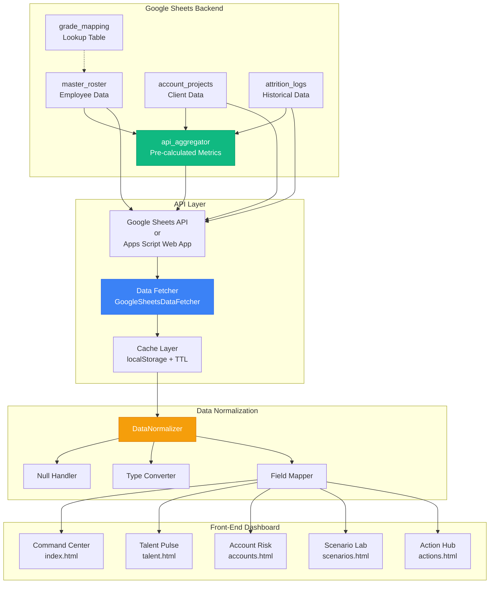
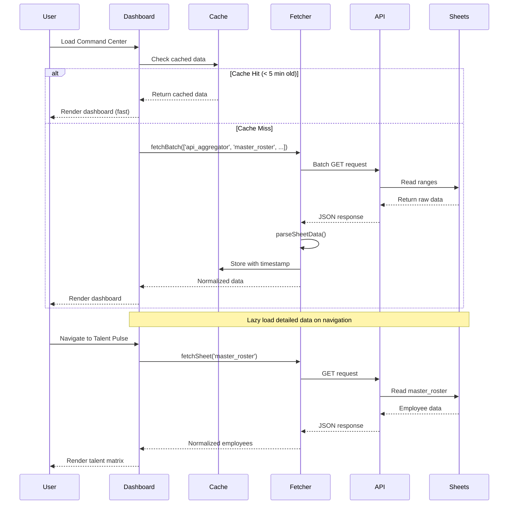
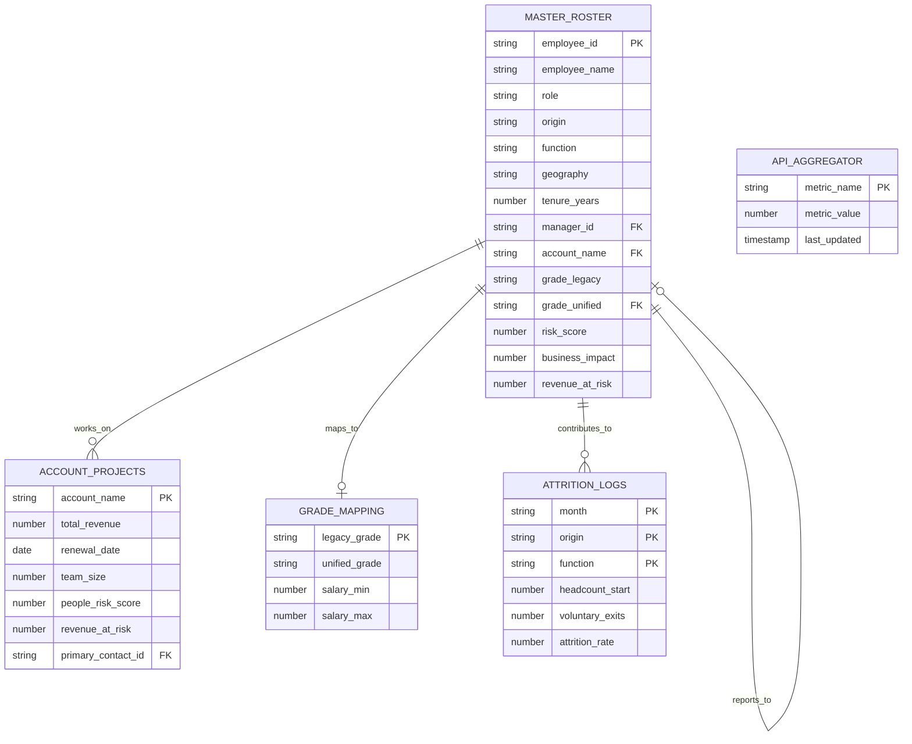
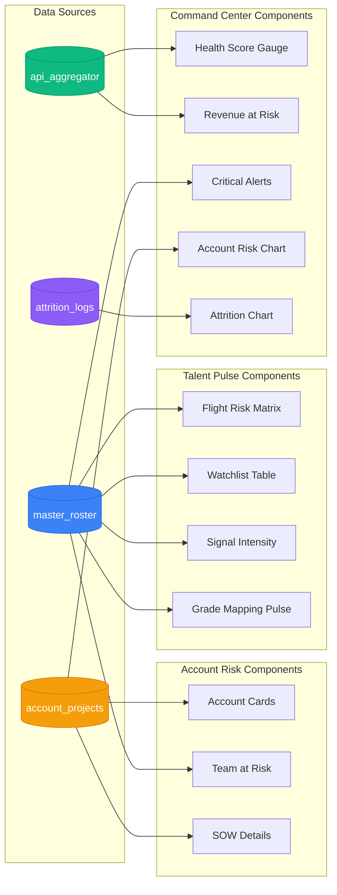
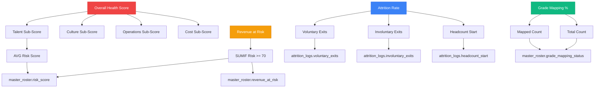
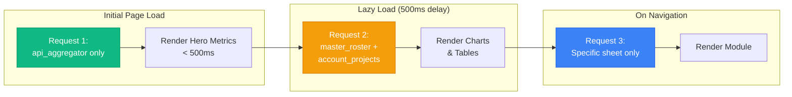
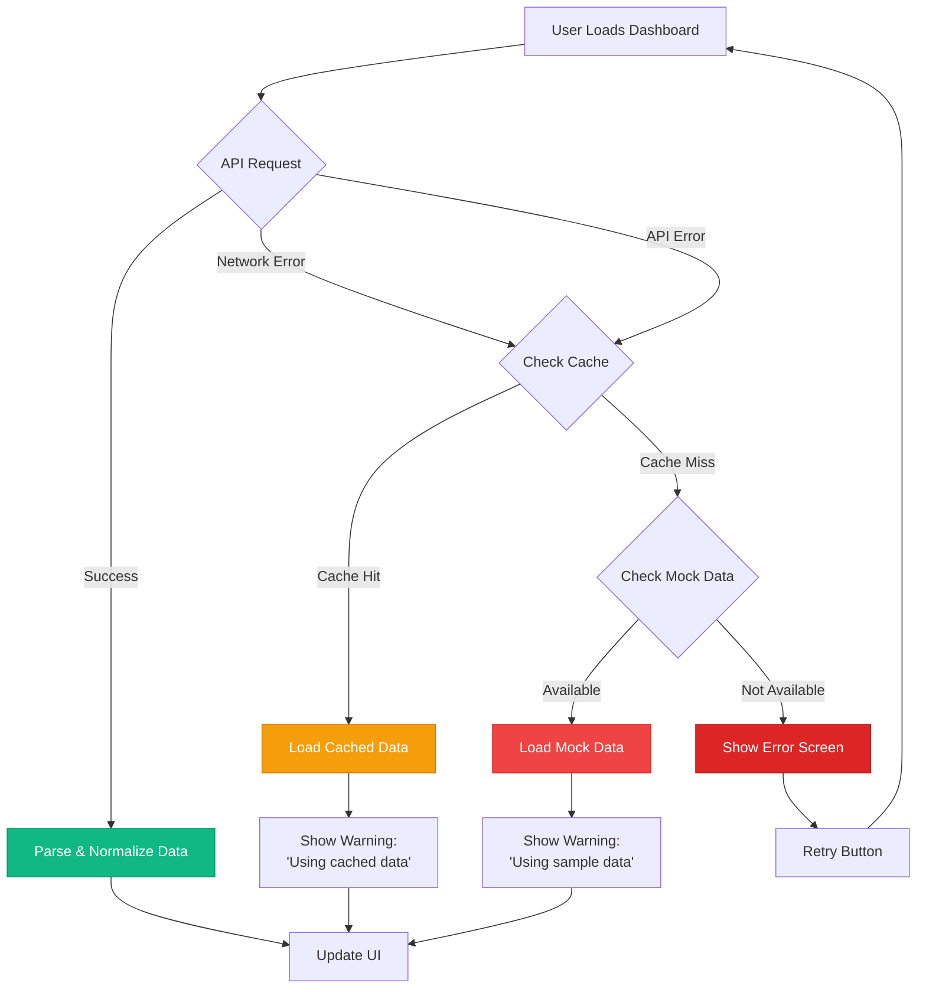

# Integration Pulse Data Flow Architecture

## System Architecture Diagram



---

## Data Flow Sequence



---

## Sheet Relationships (Entity-Relationship Diagram)



---

## Component Data Dependencies



---

## Calculated Fields Dependency Tree



---

## API Request Optimization Strategy



---

## Error Handling & Fallback Chain



---

## Data Normalization Pipeline

```mermaid
graph LR
    A[Raw Sheet Data] --> B[Parse CSV/JSON]
    B --> C[Normalize Headers]
    C --> D[Type Conversion]
    D --> E[Null Handling]
    E --> F[Field Mapping]
    F --> G[Validation]
    G --> H[Normalized Object]
    
    C -.-> C1[employee_name<br/>Full Name<br/>EmpName<br/>→ employee_name]
    D -.-> D1['TRUE' → true<br/>'123' → 123<br/>'2025-01-20' → Date]
    E -.-> E1[null → 'Unknown'<br/>'' → 0<br/>undefined → default]
    F -.-> F1[origin: 'DP'<br/>signals: ['manager_flag']<br/>tenure: 5.8]
    
    style A fill:#94A3B8,stroke:#64748B,color:#fff
    style H fill:#10B981,stroke:#059669,color:#fff
```

---

## Performance Metrics Target

| Metric | Target | Current (Mock) | With Sheets API |
|--------|--------|----------------|-----------------|
| Initial Load | < 1s | 0.3s | 0.8s |
| Dashboard Render | < 2s | 0.5s | 1.5s |
| Module Navigation | < 500ms | 0.2s | 0.4s |
| API Request | < 300ms | N/A | 200-400ms |
| Cache Hit Rate | > 80% | N/A | Target: 85% |

---

## Implementation Checklist

### Week 1: Data Setup
- [ ] Create Google Sheet with 5 tabs
- [ ] Define schemas for each sheet
- [ ] Set up Named Ranges (EmployeeRoster, AccountProjects, etc.)
- [ ] Populate sample data (20 employees, 6 accounts)
- [ ] Create `api_aggregator` formulas

### Week 2: API Integration
- [ ] Choose integration method (Apps Script vs Sheets API)
- [ ] Set up authentication (if using Sheets API)
- [ ] Implement `GoogleSheetsDataFetcher` class
- [ ] Test batch requests
- [ ] Implement caching layer

### Week 3: Front-End Wiring
- [ ] Replace `RAW_DATA` with API calls
- [ ] Implement `DataNormalizer` class
- [ ] Update `app.js`, `talent.js`, `accounts.js`
- [ ] Add loading states
- [ ] Add error handling

### Week 4: Testing & Optimization
- [ ] Load test with 350+ employees
- [ ] Optimize batch requests
- [ ] Implement lazy loading
- [ ] Performance profiling
- [ ] User acceptance testing

---

**Document Version**: 1.0  
**Last Updated**: January 20, 2025  
**Companion to**: `google_sheets_integration_strategy.md`
